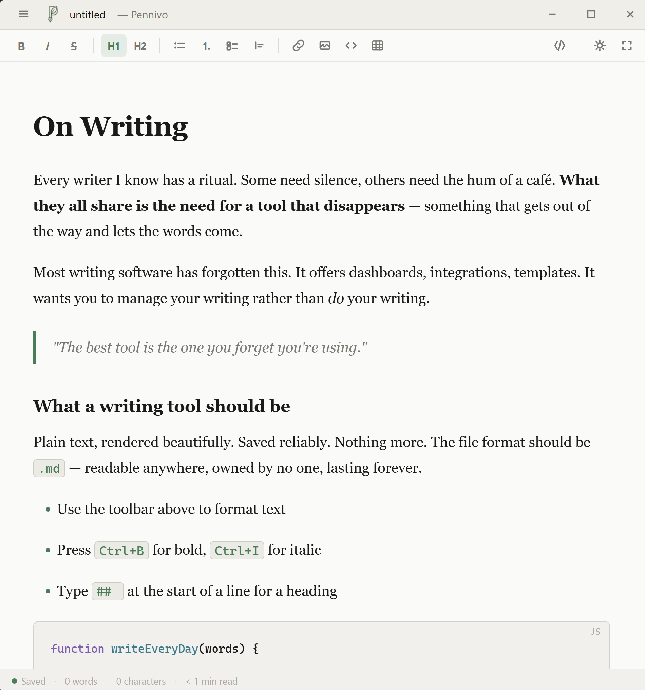
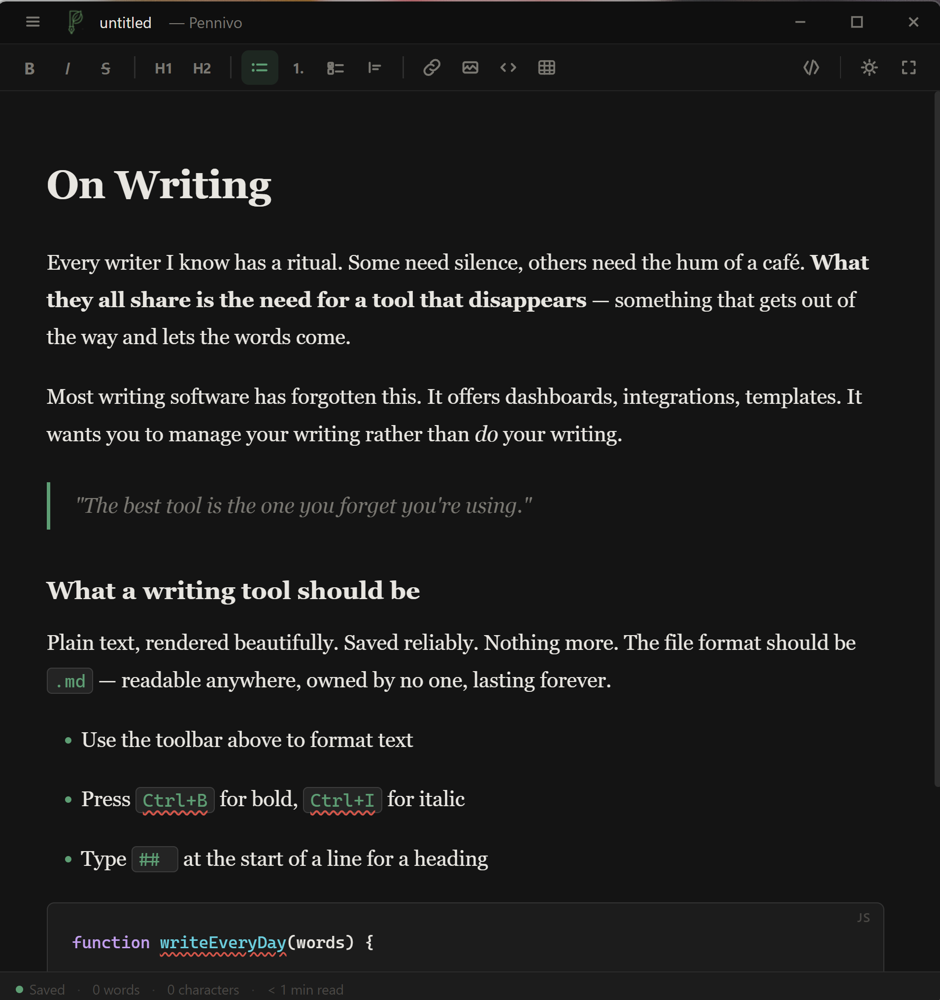
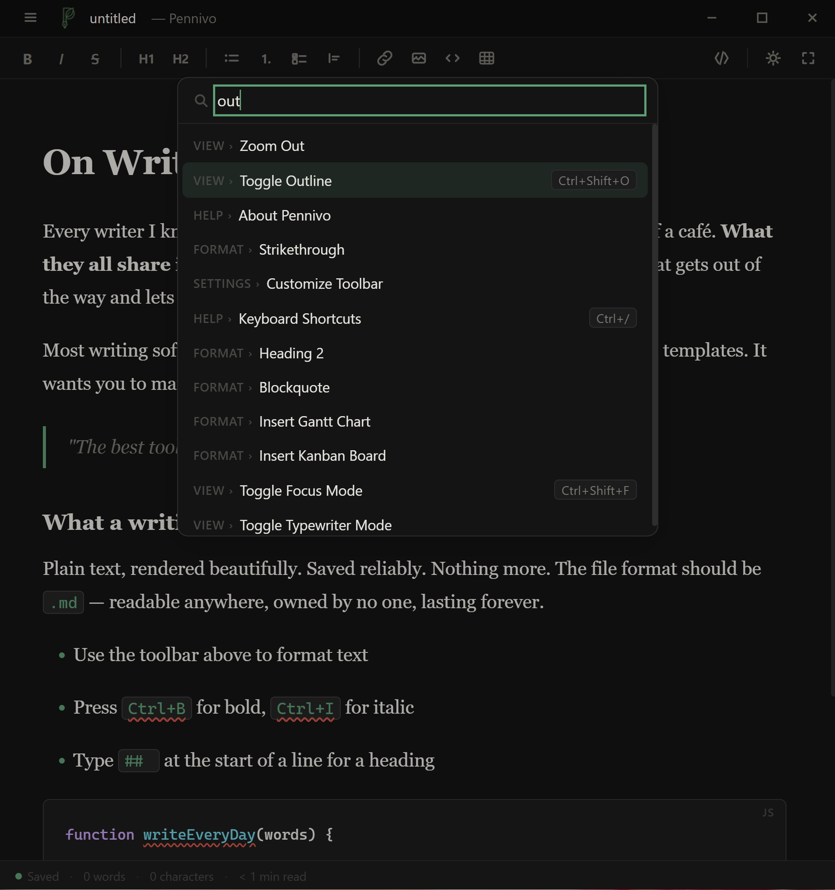
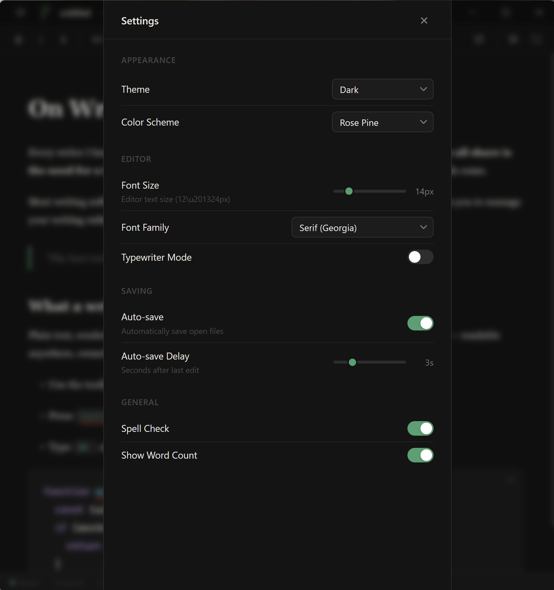
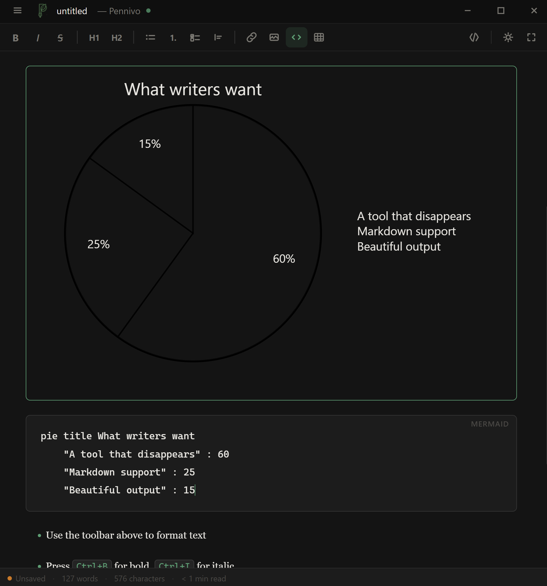
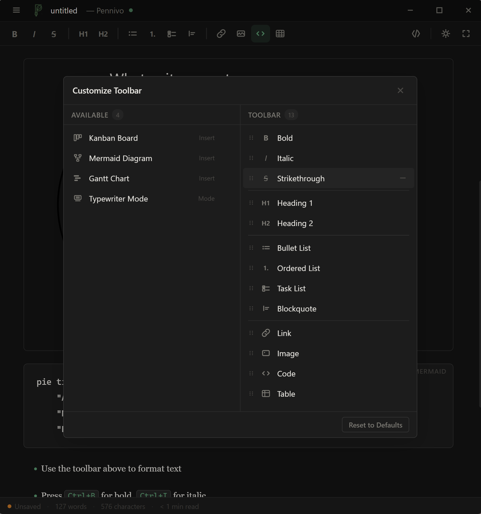

<p align="center">
  
</p>

<h1 align="center">Pennivo</h1>

<p align="center"><strong>Markdown, modernized.</strong></p>

<p align="center">
  A free, open-source markdown editor with WYSIWYG editing,<br/>
  a real source mode, and a customizable workspace.<br/>
  Desktop on Windows today, Android coming soon.
</p>

<p align="center">
  <a href="https://github.com/Payaeb/pennivo/actions/workflows/ci.yml?query=branch%3Amain"></a>
</p>

<p align="center">
  <a href="https://github.com/Payaeb/pennivo/releases/latest">Download</a> ·
  <a href="https://www.pennivo.app/">Website</a> ·
  <a href="https://github.com/Payaeb/pennivo/issues">Issues</a>
</p>

---

## Screenshots

| Light theme | Dark theme |
| :---: | :---: |
|  |  |
| **Command palette** | **Settings panel** |
|  |  |
| **Mermaid diagrams** | **Customizable toolbar** |
|  |  |

## Features

- WYSIWYG editing powered by Milkdown (ProseMirror + Remark)
- Real source mode powered by CodeMirror 6, switch any time
- Customizable toolbar — rearrange, add, and remove buttons
- File-tree sidebar, command palette (`Ctrl+Shift+P`), find & replace
- Visual table editor with floating toolbar and keyboard navigation
- Mermaid diagrams (flowchart, sequence, class, gantt, pie, etc.)
- Visual Gantt chart editor and Kanban board editor
- Outline panel, focus mode, typewriter mode
- Themes: Default, Sepia, Nord, Rose Pine — each with dark variants
- Spell check, word/character count, reading time
- Auto-save with draft recovery
- Drag-and-drop file open, paste images from clipboard, `.md` file association
- HTML and PDF export
- Auto-update via GitHub Releases
- Plain `.md` files on disk — no vault, no account, no lock-in
- WCAG 2.1 AA accessibility

## Install

### Windows

Grab the latest installer from the [Releases page](https://github.com/Payaeb/pennivo/releases/latest):

- `Pennivo-Setup-X.Y.Z.exe` — NSIS installer, ~110 MB

#### Windows SmartScreen warning

Pennivo v1.0 ships **unsigned**. When you run the installer Windows will show a SmartScreen warning titled *"Windows protected your PC"*. To proceed:

1. Click **More info**
2. Click **Run anyway**

The warning is expected and unavoidable until a code-signing certificate is in place. The installer is built directly from this repository by [GitHub Actions](.github/workflows/release.yml) — you can verify the source for each release against the published artifacts.

### Android

An Android build is in active development and will ship to Google Play and F-Droid alongside the next release. It shares the same core editor as the desktop app and runs inside a Capacitor shell tuned for phones and tablets — mobile editor, formatting toolbar, file browser, and SAF-based file import/export.

Watch the [Releases page](https://github.com/Payaeb/pennivo/releases) for the first public beta.

### macOS and Linux

Not yet. Cross-platform desktop builds are planned for a follow-up release.

## Tech stack

- TypeScript, React 19, Vite 6
- Electron 35 (desktop shell)
- Milkdown 7 (ProseMirror + Remark) — WYSIWYG editor
- CodeMirror 6 — source mode
- Mermaid 11 — diagrams
- Vitest + React Testing Library — tests
- electron-builder + electron-updater — packaging and auto-update

## Project structure

```
packages/
  core/      Editor engine — framework-agnostic TypeScript
  ui/        Shared React components, themes, editor shell
  desktop/   Electron shell — file I/O, native menus, IPC, packaging
```

`core/` has no React, DOM, or Electron dependencies. `ui/` has no Electron or Node dependencies.

## Development

### Prerequisites

- Node.js 22 or newer
- pnpm 10 or newer

### Setup

```bash
pnpm install
pnpm dev
```

### Common commands

| Command | Description |
| --- | --- |
| `pnpm dev` | Start the desktop app in development mode |
| `pnpm build` | Build all packages and the desktop bundle |
| `pnpm test` | Run all tests across packages |
| `pnpm typecheck` | Type-check all packages |
| `pnpm lint` | Lint all source files |
| `pnpm format` | Format with Prettier |
| `pnpm --filter @pennivo/desktop dist` | Build the Windows installer locally |

### Notes for contributors

- The workspace uses pnpm with `node-linker=hoisted` (see [.npmrc](.npmrc)). This is required for electron-builder to trace transitive dependencies into the packed `app.asar`. Don't change it.
- `electron` is pinned to an exact version in [packages/desktop/package.json](packages/desktop/package.json) — electron-builder requires a fixed version under hoisted layouts.
- Issues and pull requests are welcome. For larger changes, please open an issue first so we can discuss the approach.

## License

[MIT](LICENSE) © 2026 Paya Ebrahimi
